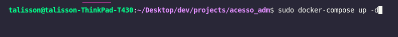
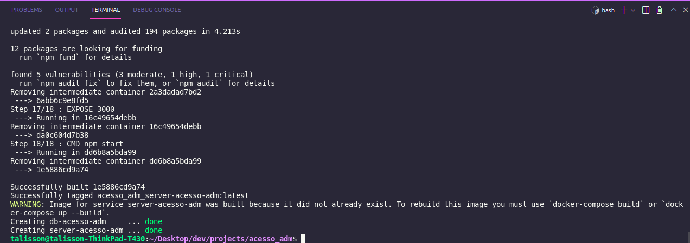
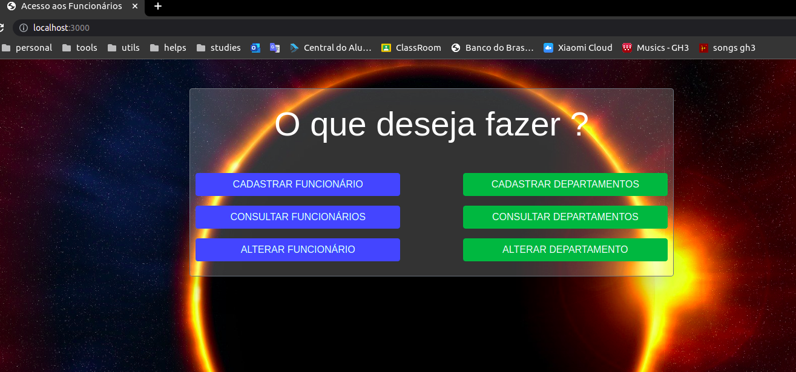

# CONTROLE ADM 

## SUMÁRIO

1. [Introdução](#INTRODUÇÃO)
2. [Arquitetura](#ARQUITETURA)
3. [Tecnologias](#TECNOLOGIAS)
4. [Setup Local](#SETUP_LOCAL)
5. [Aplicação](#APLICAÇÃO)
   * [Front-end](#FRONT-END)
   * [Back-end](#BACK-END)      
   * [Banco de dados](#BANCO-DE-DADOS)  
6. [Sobre](#SOBRE)

## INTRODUÇÃO

Web Service que simula um controle de administração corporativo.

## ARQUITETURA

## TECNOLOGIAS

* Node 14.15   
* Express 4.17
* Handlebars 5.1
* MySql 8

## SETUP_LOCAL

Para facilitar o setup local e ser possível rodar a aplicação sem necessidade de muitas configurações, todo ecossitema roda em um container Docker.  
Para isso, é necessário ter instalado em sua máquina o Docker e o Docker Compose. Abaixo contém os links para instalação no Ubuntu 20.04 e Windows 10.

**Link para instalação do Docker no Ubuntu 20.04**  
https://www.digitalocean.com/community/tutorials/how-to-install-and-use-docker-on-ubuntu-20-04-pt

**Link para instalação do Docker Compose no Ubuntu 20.04**  
https://www.digitalocean.com/community/tutorials/how-to-install-and-use-docker-compose-on-ubuntu-20-04-pt

**Link para download do Docker para Windows 10**  
*Por padrão o Docker Compose já vem instalado com o Docker Desktop*  
https://docs.docker.com/desktop/windows/install/


Após ter istalado as ferramentas necessárias, para iniciar o sistema, basta abrir o _terminal_ **na pasta raiz** deste projeto e executar o seguinte comando:
```bash
docker-compose up -d
```



_**NOTA:** No Linux pode ser necessário a permissão de superuser para executar o docker, então basta incluir a palavra "sudo" antes do comando._

Após executar este comando, aguarde até o processo de montagem dos containers finalize.  
Você verá um resultado parecido com este:  



Caso tudo ocorra corretamente, o sistema já deve estar pronto para uso, então basta que você entre no seu navegador e na barra de pesquisa inisira:
```
localhost:3000
```

Então você será redirecionado a página Home.



Pronto! Você já pode começar a interagir com o sistema!

### **POSSÍVEL ERRO**

Um erro que pode acontecer, é de conlito de portas em sua máquina, pois pode ser que algum software já esteja usando a porta **3000** que foi a definida como padrão para ser usada neste projeto.  
Caso isso ocorra, você pode desativar o software que está utilizando a porta temporariamente, ou pode mudar a exposição de portas no arquivo _docker-compose.yaml_ dentro do componente "server-acesso-adm".

## APLICAÇÃO
### FRONT-END

Páginas desenvolvidas com Handlebars.

### BACK-END

Back-End desenvolvido com Node.Js.

#### API

#### AUTENTICAÇÃO

#### ENDPOINTS

## BANCO-DE-DADOS


## SOBRE 

* Desenvolvido por: Talisson Maciel Luques
* Finalidade: Testes de conhecimento e aplicação de prática, focando principalmente no back-end.
